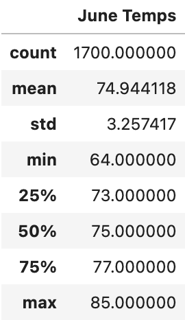

# Surf’s Up!
Providing additional insight into weather data in the months of July and December to analyze if a year round surf and ice cream shop is viable.

### Results:

#### June Results 

* Looking at our summary statistics we show June has an average temperature of roughly 75 degrees with a maximum of 85 degrees.

* Our analysis of the temperatures in December shows a slightly lower average temperature at 71 degrees. Our minimum and maximum temperatures have also decreased to 56 degrees and 83 degrees, respectively.

## Summary: 
* After analyzing our two months in question we can confidently show the board and W. Avy that it would be okay to have our ice cream surf shop year round.

* The average temperatures from June and December only dropped by about 4 degrees which is not statistically a big difference to sway people to not buy ice cream. 

* Another query that could further the analysis would be a week by week overview on how temperatures swing week to week (i.e. a cold front coming in) in order to decide if maybe some weeks the hours should be reduced. 
